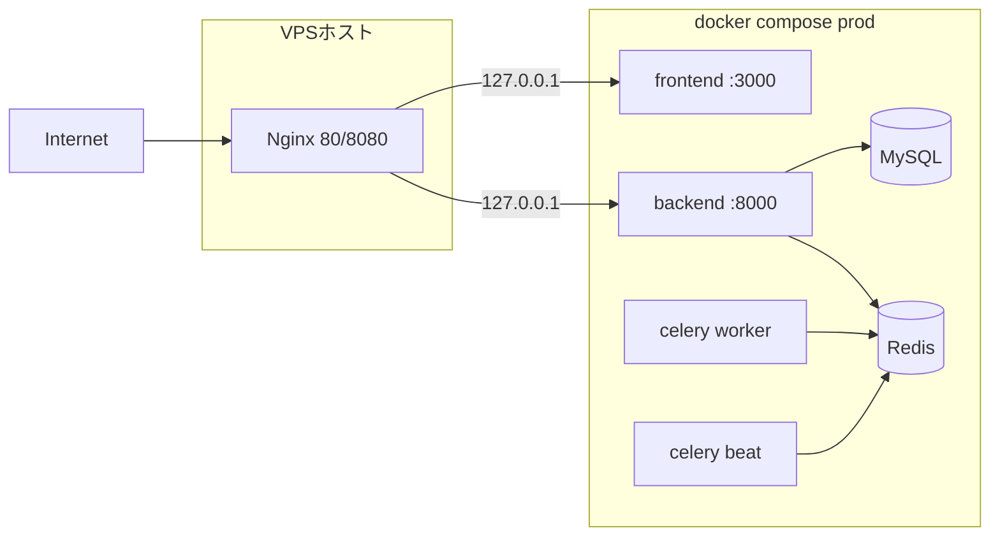

# Xserver VPS 上で Docker（Compose）により本番相当環境を構築する手順

本書は **[Xserverセットアップ手順.MD](Xserverセットアップ手順.MD)**（**ホストに直接** MySQL・systemd・Nginx を載せる方法）とは**別ルート**です。  
**コンテナで DB・Redis・バックエンド・Celery・フロントをまとめて動かす**場合の参考手順です。

公式の本番推奨は引き続き [docs/RENTAL_SERVER_DEPLOYMENT.md](docs/RENTAL_SERVER_DEPLOYMENT.md)（素の VPS）です。Docker 本番は**チームでメンテする前提の自己責任オプション**です。

---

## 1. 向いている／向いていない

| 向いている | 向いていない |
|------------|----------------|
| ローカルと同じく Compose で揃えたい | 無料枠など **メモリが極端に小さい**（コンテナオーバーヘッドで厳しい） |
| Xserver の **Docker 入り VPS** を活かしたい | 公式ドキュメントどおりの**唯一の正解**にしたい（→ 素の VPS 手順） |
| 複数環境の再現性を優先 | 既に [Xserverセットアップ手順.MD](Xserverセットアップ手順.MD) で動いているものを壊したくない（**同居させない**。別サーバーまたは移行計画） |

---

## 2. 前提

- VPS 上に **Docker Engine** と **Docker Compose plugin**（`docker compose`）が使えること。
- リポジトリを VPS に clone 済み（例: `/srv/photo_contest`）。
- ルートの [docker-compose.yml](docker-compose.yml) は **開発向け**（`npm run dev`・ソースマウント）のため、**本番では使わない**。下記 **`docker-compose.prod.yml` と本番用フロント Dockerfile** を別途置く。

---

## 3. 全体像



- **DB / Redis** は compose 内ネットワークのみに閉じ、**ホストにポートを晒さない**（下記 YAML 例）。
- **バックエンド・フロント**は **`127.0.0.1` のみ**にバインドして公開し、**ホストの Nginx** がリバースプロキシする（[deploy/nginx/](deploy/nginx/) の考え方と同じ）。

---

## 4. 本番用フロント Dockerfile（新規ファイル）

開発用 [frontend/Dockerfile](frontend/Dockerfile) は `npm run dev` のため、**本番では使わない**。  
`frontend/Dockerfile.prod` として次を**新規作成**する（パスはリポジトリルートからの相対）。

```dockerfile
# frontend/Dockerfile.prod — 本番: next build + next start
FROM node:22-alpine AS builder

WORKDIR /app

COPY package*.json ./
RUN npm ci --legacy-peer-deps

COPY . .

ARG NEXT_PUBLIC_API_URL
ARG NEXT_PUBLIC_GOOGLE_CLIENT_ID
ARG NEXT_PUBLIC_TWITTER_ENABLED=false

ENV NEXT_PUBLIC_API_URL=$NEXT_PUBLIC_API_URL
ENV NEXT_PUBLIC_GOOGLE_CLIENT_ID=$NEXT_PUBLIC_GOOGLE_CLIENT_ID
ENV NEXT_PUBLIC_TWITTER_ENABLED=$NEXT_PUBLIC_TWITTER_ENABLED

RUN npm run build

FROM node:22-alpine AS runner

WORKDIR /app

ENV NODE_ENV=production

COPY package*.json ./
RUN npm ci --legacy-peer-deps --omit=dev

COPY --from=builder /app/.next ./.next
COPY --from=builder /app/public ./public
COPY --from=builder /app/next.config.js ./next.config.js

EXPOSE 3000

CMD ["npm", "run", "start"]
```

`next.config` の拡張子が異なる場合は `COPY` 行を実ファイルに合わせる。

---

## 5. `docker-compose.prod.yml`（リポジトリルートに新規作成）

**注意**: 環境変数は `.env` または `env_file` で渡す。秘密はリポジトリにコミットしない。

```yaml
name: photocontest-prod

services:
  db:
    image: mysql:8.0
    environment:
      MYSQL_ROOT_PASSWORD: ${MYSQL_ROOT_PASSWORD}
      MYSQL_DATABASE: ${MYSQL_DATABASE:-contest}
      MYSQL_USER: ${MYSQL_USER:-contestuser}
      MYSQL_PASSWORD: ${MYSQL_PASSWORD}
    volumes:
      - db_data:/var/lib/mysql
    healthcheck:
      test: ["CMD", "mysqladmin", "ping", "-h", "localhost"]
      interval: 5s
      timeout: 5s
      retries: 10
    command: --character-set-server=utf8mb4 --collation-server=utf8mb4_unicode_ci
    networks:
      - internal

  redis:
    image: redis:7-alpine
    healthcheck:
      test: ["CMD", "redis-cli", "ping"]
      interval: 5s
      timeout: 3s
      retries: 5
    networks:
      - internal

  backend:
    build:
      context: ./backend
      dockerfile: Dockerfile
    # command は指定しない。[backend/entrypoint.sh](backend/entrypoint.sh) が
    # collectstatic → DB 待ち → migrate → スーパーユーザー/OAuth 環境変数処理 → Gunicorn を実行する。
    # Celery は別コンテナで動かすため、同一コンテナ内では起動させない。
    ports:
      - "127.0.0.1:8080:8000"
    env_file:
      - .env.production
    environment:
      ENABLE_CELERY: "false"
      DATABASE_URL: mysql://${MYSQL_USER:-contestuser}:${MYSQL_PASSWORD}@db:3306/${MYSQL_DATABASE:-contest}
      REDIS_URL: redis://redis:6379/0
      CELERY_BROKER_URL: redis://redis:6379/0
      CELERY_RESULT_BACKEND: redis://redis:6379/0
    volumes:
      - media_data:/app/media
      - static_data:/app/staticfiles
    depends_on:
      db:
        condition: service_healthy
      redis:
        condition: service_healthy
    networks:
      - internal

  celery_worker:
    build:
      context: ./backend
      dockerfile: Dockerfile
    command: celery -A config worker -l info --concurrency=2
    env_file:
      - .env.production
    environment:
      DATABASE_URL: mysql://${MYSQL_USER:-contestuser}:${MYSQL_PASSWORD}@db:3306/${MYSQL_DATABASE:-contest}
      REDIS_URL: redis://redis:6379/0
      CELERY_BROKER_URL: redis://redis:6379/0
      CELERY_RESULT_BACKEND: redis://redis:6379/0
    volumes:
      - media_data:/app/media
    depends_on:
      - db
      - redis
      - backend
    networks:
      - internal

  celery_beat:
    build:
      context: ./backend
      dockerfile: Dockerfile
    command: celery -A config beat -l info --scheduler django_celery_beat.schedulers:DatabaseScheduler
    env_file:
      - .env.production
    environment:
      DATABASE_URL: mysql://${MYSQL_USER:-contestuser}:${MYSQL_PASSWORD}@db:3306/${MYSQL_DATABASE:-contest}
      REDIS_URL: redis://redis:6379/0
      CELERY_BROKER_URL: redis://redis:6379/0
      CELERY_RESULT_BACKEND: redis://redis:6379/0
    depends_on:
      - db
      - redis
      - backend
    networks:
      - internal

  frontend:
    build:
      context: ./frontend
      dockerfile: Dockerfile.prod
      args:
        NEXT_PUBLIC_API_URL: ${NEXT_PUBLIC_API_URL}
        NEXT_PUBLIC_GOOGLE_CLIENT_ID: ${NEXT_PUBLIC_GOOGLE_CLIENT_ID}
        NEXT_PUBLIC_TWITTER_ENABLED: ${NEXT_PUBLIC_TWITTER_ENABLED:-false}
    ports:
      - "127.0.0.1:3000:3000"
    env_file:
      - .env.production
    depends_on:
      - backend
    networks:
      - internal

volumes:
  db_data:
  media_data:
  static_data:

networks:
  internal:
    driver: bridge
```

- **ホストの Nginx** は [Xserverセットアップ手順.MD](Xserverセットアップ手順.MD) と同様、`proxy_pass http://127.0.0.1:3000`（フロント）と `http://127.0.0.1:8080`（API）を指す。
- `staticfiles` はボリューム内のため、**Nginx で直接 `alias` するにはホストにマウントが必要**。簡易運用では **Django／WhiteNoise 経由**で配信される設定のままにするか、`deploy/nginx` の `alias` を**ホストパスに合わせて**別途設計する。

---

## 6. `.env.production`（VPS 上のみ・Git に含めない）

[docs/RENTAL_SERVER_DEPLOYMENT.md](docs/RENTAL_SERVER_DEPLOYMENT.md) の本番変数に近づける。例（値は置き換え）:

```bash
DEBUG=False
SECRET_KEY=（十分に長いランダム文字列）
DJANGO_SETTINGS_MODULE=config.settings

MYSQL_PASSWORD=（DB用）
MYSQL_ROOT_PASSWORD=（root用）

ALLOWED_HOSTS=your.domain,127.0.0.1,localhost
CSRF_TRUSTED_ORIGINS=https://your.domain,https://api.your.domain
CORS_ALLOWED_ORIGINS=https://your.domain

# HTTP のみの暫定なら [Xserverセットアップ手順.MD] の CSRF 節を参照
# SESSION_CSRF_COOKIE_SECURE=False

NEXT_PUBLIC_API_URL=https://api.your.domain/api
NEXT_PUBLIC_GOOGLE_CLIENT_ID=...
NEXT_PUBLIC_TWITTER_ENABLED=false

GOOGLE_OAUTH_CLIENT_ID=...
GOOGLE_OAUTH_CLIENT_SECRET=...
# Twitter 系も必要なら追加
```

`NEXT_PUBLIC_*` は **フロントイメージの build 時**に埋め込まれる。URL を変えたら **`docker compose -f docker-compose.prod.yml build --no-cache frontend`** が必要。

---

## 7. 初回起動コマンド（VPS 上）

```bash
cd /srv/photo_contest   # clone 先

# Dockerfile.prod と docker-compose.prod.yml を配置済みであること
docker compose -f docker-compose.prod.yml --env-file .env.production build
docker compose -f docker-compose.prod.yml --env-file .env.production up -d
```

スーパーユーザー作成（例）:

```bash
docker compose -f docker-compose.prod.yml --env-file .env.production exec backend \
  python manage.py createsuperuser
```

---

## 8. ホスト側 Nginx・ファイアウォール

- [Xserverセットアップ手順.MD](Xserverセットアップ手順.MD) の **Nginx**・**パケットフィルター（80 / 443 / API 用ポート）** と同じ考え方。
- MySQL・Redis は **compose 内だけ**に閉じているため、**3306 / 6379 をパケットフィルターで開ける必要はない**（誤って開けないこと）。

---

## 9. 更新デプロイの流れ

```bash
cd /srv/photo_contest
git pull
docker compose -f docker-compose.prod.yml --env-file .env.production build
docker compose -f docker-compose.prod.yml --env-file .env.production up -d
```

マイグレーションは [backend/entrypoint.sh](backend/entrypoint.sh) が起動時に実行する（上記 YAML では `command` を上書きしていない）。独自に `command` を付けた場合は、マイグレーションや `create_superuser_from_env` がスキップされうるので注意する。

---

## 10. バックアップ

- **DB**: `docker compose -f docker-compose.prod.yml exec -T db mysqldump -u contestuser -p... contest > backup.sql` 等。
- **メディア**: ボリューム `media_data` のバックアップ方針（`docker run --rm -v photocontest-prod_media_data:/data ...`）を決める。

---

## 11. よくあるハマりどころ

| 現象 | 確認 |
|------|------|
| フロントが API に繋がらない | `NEXT_PUBLIC_API_URL` が**ブラウザから見える URL**と一致しているか。build し直したか。 |
| 管理画面 CSRF 403（HTTP） | [Xserverセットアップ手順.MD §12.5](Xserverセットアップ手順.MD) と同様 `SESSION_CSRF_COOKIE_SECURE=False`（HTTPS 化したら戻す）。 |
| Celery が動かない | `CELERY_BROKER_URL` / `REDIS_URL` と `depends_on`。 |

---

## 12. 関連ドキュメント

- [Xserverセットアップ手順.MD](Xserverセットアップ手順.MD) … **Docker を使わない** Xserver 向け手順（実績ベース）
- [docs/RENTAL_SERVER_DEPLOYMENT.md](docs/RENTAL_SERVER_DEPLOYMENT.md) … 本番推奨（素の VPS）
- [docker-compose.yml](docker-compose.yml) … **開発専用**
